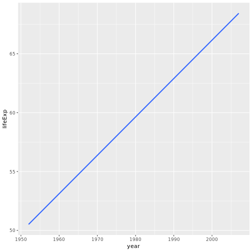

```r
suppressPackageStartupMessages(library(tidyverse))
suppressPackageStartupMessages(library(gapminder))
```

## `mutate()`

Let's get:

- GDP by multiplying GPD per capita with population, and
- GDP in billions, named (`gdpBill`), rounded to two decimals.


```r
gapminder %>%
  mutate(gdp = gdpPercap * pop,
         gdpBill = round( gdp / 10^9),
         )
```

```
## # A tibble: 1,704 x 8
##    country    continent  year lifeExp     pop gdpPercap        gdp gdpBill
##    <fct>      <fct>     <int>   <dbl>   <int>     <dbl>      <dbl>   <dbl>
##  1 Afghanist… Asia       1952    28.8  8.43e6      779.    6.57e 9       7
##  2 Afghanist… Asia       1957    30.3  9.24e6      821.    7.59e 9       8
##  3 Afghanist… Asia       1962    32.0  1.03e7      853.    8.76e 9       9
##  4 Afghanist… Asia       1967    34.0  1.15e7      836.    9.65e 9      10
##  5 Afghanist… Asia       1972    36.1  1.31e7      740.    9.68e 9      10
##  6 Afghanist… Asia       1977    38.4  1.49e7      786.    1.17e10      12
##  7 Afghanist… Asia       1982    39.9  1.29e7      978.    1.26e10      13
##  8 Afghanist… Asia       1987    40.8  1.39e7      852.    1.18e10      12
##  9 Afghanist… Asia       1992    41.7  1.63e7      649.    1.06e10      11
## 10 Afghanist… Asia       1997    41.8  2.22e7      635.    1.41e10      14
## # ... with 1,694 more rows
```


Notice the backwards compatibility! No need for loops!

Try the same thing, but with `transmute` (drops all other variables).


```r
gapminder %>%
  transmute(gdp = gdpPercap * pop,
         gdpBill = round( gdp / 10^9),
         )
```

```
## # A tibble: 1,704 x 2
##             gdp gdpBill
##           <dbl>   <dbl>
##  1  6567086330.       7
##  2  7585448670.       8
##  3  8758855797.       9
##  4  9648014150.      10
##  5  9678553274.      10
##  6 11697659231.      12
##  7 12598563401.      13
##  8 11820990309.      12
##  9 10595901589.      11
## 10 14121995875.      14
## # ... with 1,694 more rows
```

The `if_else` function is useful for changing certain elements in a data frame.

Example: Suppose Canada's 1952 life expectancy was mistakenly entered as 68.8 in the data frame, but is actually 70. Fix it using `if_else` and `mutate`.


```r
gapminder %>%
  mutate(lifeExp = if_else(year == 1952 & country == "Canada", 70, lifeExp)) %>%
  filter(country == "Canada")
```

```
## # A tibble: 12 x 6
##    country continent  year lifeExp      pop gdpPercap
##    <fct>   <fct>     <int>   <dbl>    <int>     <dbl>
##  1 Canada  Americas   1952    70   14785584    11367.
##  2 Canada  Americas   1957    70.0 17010154    12490.
##  3 Canada  Americas   1962    71.3 18985849    13462.
##  4 Canada  Americas   1967    72.1 20819767    16077.
##  5 Canada  Americas   1972    72.9 22284500    18971.
##  6 Canada  Americas   1977    74.2 23796400    22091.
##  7 Canada  Americas   1982    75.8 25201900    22899.
##  8 Canada  Americas   1987    76.9 26549700    26627.
##  9 Canada  Americas   1992    78.0 28523502    26343.
## 10 Canada  Americas   1997    78.6 30305843    28955.
## 11 Canada  Americas   2002    79.8 31902268    33329.
## 12 Canada  Americas   2007    80.7 33390141    36319.
```


Your turn: Make a new column called `cc` that pastes the country name followed by the continent, separated by a comma. (Hint: use the `paste` function with the `sep=", "` argument).


```r
gapminder %>%
  mutate(cc = paste(country, continent, sep = ", "))
```

```
## # A tibble: 1,704 x 7
##    country     continent  year lifeExp      pop gdpPercap cc               
##    <fct>       <fct>     <int>   <dbl>    <int>     <dbl> <chr>            
##  1 Afghanistan Asia       1952    28.8  8425333      779. Afghanistan, Asia
##  2 Afghanistan Asia       1957    30.3  9240934      821. Afghanistan, Asia
##  3 Afghanistan Asia       1962    32.0 10267083      853. Afghanistan, Asia
##  4 Afghanistan Asia       1967    34.0 11537966      836. Afghanistan, Asia
##  5 Afghanistan Asia       1972    36.1 13079460      740. Afghanistan, Asia
##  6 Afghanistan Asia       1977    38.4 14880372      786. Afghanistan, Asia
##  7 Afghanistan Asia       1982    39.9 12881816      978. Afghanistan, Asia
##  8 Afghanistan Asia       1987    40.8 13867957      852. Afghanistan, Asia
##  9 Afghanistan Asia       1992    41.7 16317921      649. Afghanistan, Asia
## 10 Afghanistan Asia       1997    41.8 22227415      635. Afghanistan, Asia
## # ... with 1,694 more rows
```

These functions we've seen are called __vectorized functions__.

## `summarize()` and `group_by()`

Use `summarize()` to compute the mean and median life expectancy using all entries:


```r
gapminder %>%
  summarize(
    mean = mean(lifeExp),
    median = median(lifeExp)
  )
```

```
## # A tibble: 1 x 2
##    mean median
##   <dbl>  <dbl>
## 1  59.5   60.7
```

Do the same thing, but try:

1. grouping by country
2. grouping by continent and country


```r
gapminder %>%
  group_by(country) %>%
??? from here until ???END lines may have been inserted/deleted
  summarize(
    mu = mean(lifeExp),
    md = median(lifeExp)
  )

gapminder %>%
  group_by(continent, country) %>%
  summarize(
    mu = mean(lifeExp),
    md = median(lifeExp)
  )
```

```
## Error: <text>:3:10: unexpected symbol
## 2:   group_by(country) %>%
## 3: ??? from here
##             ^
```

- Notice the columns that are kept.
- Notice the grouping listed above the tibble, especially without a call after grouping.
- Notice the peeling of groups for each summarize.

Question: What if I wanted to keep the other numeric columns (gdpPercap, pop)? Can I? Would this even make sense?

For each continent: What is the smallest country-wide median GDP per capita?


```r
gapminder %>%
  group_by(continent, country) %>%
  summarize(md = median(gdpPercap)) %>%
  summarize(min = min(md))
```

```
## # A tibble: 5 x 2
##   continent    min
##   <fct>      <dbl>
## 1 Africa      455.
## 2 Americas   1691.
## 3 Asia        378 
## 4 Europe     3194.
## 5 Oceania   16933.
```

Note that ggplot2's grouping is different from dplyr's! Try making a spaghetti plot of lifeExp over time for each coutry, by piping in a grouped data frame -- it won't work:


```r
gapminder %>%
  group_by(country) %>%
  ggplot(aes(year, lifeExp)) +
    geom_smooth(method = "lm", se = F)
```




Your turn! For each continent, what is the median GDP per capita of countries with high (>60) life expectancy vs countries with low (<=60)? Sort this data frame by median GDP per capita.


```r
gapminder %>%
  mutate(hi = if_else(lifeExp > 60, gdpPercap, NULL),
         lo = if_else(lifeExp <= 60, gdpPercap, NULL) )%>%
  group_by(continent, country) %>%
  summarize(hi = median(hi, na.rm = T),
            lo = median(lo, na.rm = T)) %>%
  summarize(hi = median(hi, na.rm = T),
            lo = median(lo, na.rm = T),
            diff = hi - lo )
```

```
## # A tibble: 5 x 4
##   continent     hi    lo   diff
##   <fct>      <dbl> <dbl>  <dbl>
## 1 Africa     4247. 1192.  3055.
## 2 Americas   6135. 3243.  2892.
## 3 Asia       3845. 1512.  2333.
## 4 Europe    14640. 2575. 12066.
## 5 Oceania   17919.   NA     NA
```

```r
gapminder %>%
  group_by(continent, lifeExp > 60) %>%
  summarize(md = median(gdpPercap)) %>%
  arrange(md)
```

```
## # A tibble: 9 x 3
## # Groups:   continent [5]
##   continent `lifeExp > 60`     md
##   <fct>     <lgl>           <dbl>
## 1 Asia      FALSE           1031.
## 2 Africa    FALSE           1071.
## 3 Europe    FALSE           2384.
## 4 Americas  FALSE           3080.
## 5 Africa    TRUE            4442.
## 6 Asia      TRUE            5250.
## 7 Americas  TRUE            6678.
## 8 Europe    TRUE           12672.
## 9 Oceania   TRUE           17983.
```

There are special functions to summarize by. Let's see some of them:

- `n()`: Number of rows in the group.
- `n_distinct()`

Convenience functions:

- `tally()` (= `summarize(n = n())`)
- `count(...)` (= `group_by(...) %>% tally()`)

n_distinct: How many years of record does each country have?


```r
gapminder %>%
  group_by(continent) %>%
  summarize(n = n(),
            nyears = n_distinct(year))
```

```
## # A tibble: 5 x 3
##   continent     n nyears
##   <fct>     <int>  <int>
## 1 Africa      624     12
## 2 Americas    300     12
## 3 Asia        396     12
## 4 Europe      360     12
## 5 Oceania      24     12
```

```r
gapminder %>%
  group_by(continent) %>%
  tally()
```

```
## # A tibble: 5 x 2
##   continent     n
##   <fct>     <int>
## 1 Africa      624
## 2 Americas    300
## 3 Asia        396
## 4 Europe      360
## 5 Oceania      24
```

```r
gapminder %>%
  count(continent)
```

```
## # A tibble: 5 x 2
##   continent     n
##   <fct>     <int>
## 1 Africa      624
## 2 Americas    300
## 3 Asia        396
## 4 Europe      360
## 5 Oceania      24
```

count

## Function types

Let's stop to identify some theory of function types, and the `dplyr` approach to them.

| Function type | Explanation | Examples | In `dplyr` |
|------|-----|----|----|
| Vectorized functions | These take a vector, and operate on each component independently to return a vector of the same length. In other words, they work element-wise. | `cos`, `sin`, `log`, `exp`, `round` | `mutate` |
| Aggregate functions | These take a vector, and return a vector of length 1 | `mean`, `sd`, `length`, `typeof` | `summarize`, esp with `group_by`. |
| Window Functions | these take a vector, and return a vector of the same length that depends on the vector as a whole. | `lag`, `rank`, `cumsum` | `mutate`, esp with `group_by` |

For any generic output, we can use dplyr's `do()` function -- but that's a topic for STAT 547.

## Grouped `mutate()`

Calculate the growth in population since the first year on record _for each country_. `first()` is useful.


```r
gapminder %>%
  group_by(country) %>%
  summarize(growth = last(pop) / first(pop)) %>%
  arrange(growth)
```

```
## # A tibble: 142 x 2
##    country        growth
##    <fct>           <dbl>
##  1 Bulgaria         1.01
##  2 Hungary          1.05
##  3 Czech Republic   1.12
##  4 Croatia          1.16
##  5 Austria          1.18
##  6 Belgium          1.19
##  7 Germany          1.19
##  8 United Kingdom   1.21
##  9 Italy            1.22
## 10 Portugal         1.25
## # ... with 132 more rows
```

```r
gapminder %>%
  group_by(country) %>%
  mutate(change = pop / lag(pop))
```

```
## # A tibble: 1,704 x 7
## # Groups:   country [142]
##    country     continent  year lifeExp      pop gdpPercap change
##    <fct>       <fct>     <int>   <dbl>    <int>     <dbl>  <dbl>
##  1 Afghanistan Asia       1952    28.8  8425333      779. NA    
##  2 Afghanistan Asia       1957    30.3  9240934      821.  1.10 
##  3 Afghanistan Asia       1962    32.0 10267083      853.  1.11 
##  4 Afghanistan Asia       1967    34.0 11537966      836.  1.12 
##  5 Afghanistan Asia       1972    36.1 13079460      740.  1.13 
##  6 Afghanistan Asia       1977    38.4 14880372      786.  1.14 
##  7 Afghanistan Asia       1982    39.9 12881816      978.  0.866
##  8 Afghanistan Asia       1987    40.8 13867957      852.  1.08 
##  9 Afghanistan Asia       1992    41.7 16317921      649.  1.18 
## 10 Afghanistan Asia       1997    41.8 22227415      635.  1.36 
## # ... with 1,694 more rows
```

Notice that `dplyr` has retained the original grouping.

How about growth compared to `1972`?


```r
gapminder %>%
  group_by(country) %>%
  summarize(growth = last(pop) / something_here)) %>%
  arrange(growth)
```

```
## Error: <text>:3:49: unexpected ')'
## 2:   group_by(country) %>%
## 3:   summarize(growth = last(pop) / something_here))
##                                                    ^
```

???END
Make a new variable `pop_last_time`, as the "lag-1" population -- that is, the population from the previous entry of that country. Use the `lag` function.


```r
See above
```

```
## Error: <text>:1:5: unexpected symbol
## 1: See above
##         ^
```

Similar: `lead` function.

Notice the NA's.

## Putting it all together

Your turn: Use what we learned to answer the following questions.

1. Determine the country that experienced the sharpest 5-year drop in life expectancy, in each continent.


```r
gapminder %>%
  group_by(continent, country) %>%
  mutate(drop = lifeExp - lead(lifeExp, 5)) %>%
  summarize(bigDrop = min(drop, na.rm = T)) %>%
  summarize(drop = ???)

gapminder %>%
  group_by(continent, country) %>%
  mutate(gain = lifeExp - lag(lifeExp)) %>%
  summarize(min = min(gain, na.rm = T)) %>%
  arrange(min) %>%
  summarize(min = min(min))

#How do you tie this back to which country had this drop?
```

```
## Error: <text>:5:23: unexpected ')'
## 4:   summarize(bigDrop = min(drop, na.rm = T)) %>%
## 5:   summarize(drop = ???)
##                          ^
```

2. Compute the relative gdp (NOT per capita!) of each country compared to Canada (= GDP of a country / GDP of Canada).


```r
cda <- gapminder %>%
  filter(country == 'Canada') %>%
  mutate(gdp = gdpPercap * pop) %>%
  `[[`("gdp")

gapminder %>%
  mutate(cda_gdp = rep(cda, nlevels(country)),
         gdp = gdpPercap * pop,
         gdpRel = gdp / cda_gdp)
```

```
## # A tibble: 1,704 x 9
##    country continent  year lifeExp    pop gdpPercap cda_gdp     gdp gdpRel
##    <fct>   <fct>     <int>   <dbl>  <int>     <dbl>   <dbl>   <dbl>  <dbl>
##  1 Afghan… Asia       1952    28.8 8.43e6      779. 1.68e11 6.57e 9 0.0391
##  2 Afghan… Asia       1957    30.3 9.24e6      821. 2.12e11 7.59e 9 0.0357
##  3 Afghan… Asia       1962    32.0 1.03e7      853. 2.56e11 8.76e 9 0.0343
##  4 Afghan… Asia       1967    34.0 1.15e7      836. 3.35e11 9.65e 9 0.0288
##  5 Afghan… Asia       1972    36.1 1.31e7      740. 4.23e11 9.68e 9 0.0229
##  6 Afghan… Asia       1977    38.4 1.49e7      786. 5.26e11 1.17e10 0.0223
##  7 Afghan… Asia       1982    39.9 1.29e7      978. 5.77e11 1.26e10 0.0218
##  8 Afghan… Asia       1987    40.8 1.39e7      852. 7.07e11 1.18e10 0.0167
##  9 Afghan… Asia       1992    41.7 1.63e7      649. 7.51e11 1.06e10 0.0141
## 10 Afghan… Asia       1997    41.8 2.22e7      635. 8.78e11 1.41e10 0.0161
## # ... with 1,694 more rows
```

Sanity check: are Canada's numbers = 1? What is the spread of numbers like (should be small)?

Yep, they are (line removed, it was just a filter command)

## Summary of major one-table functions

- `select()`
- `filter()`
- `arrange()`
- `mutate()`
- `summarize()`

Together with `group_by()` and "twists" of the above.


## Practice Exercises

Practice these concepts in the following exercises. It might help you to first identify the type of function you are applying.

1. Convert the population to a number in billions.


```r
gapminder %>%
  transmute(popBill = pop / 10E9)
```

```
## # A tibble: 1,704 x 1
##     popBill
##       <dbl>
##  1 0.000843
##  2 0.000924
##  3 0.00103 
##  4 0.00115 
##  5 0.00131 
##  6 0.00149 
##  7 0.00129 
##  8 0.00139 
##  9 0.00163 
## 10 0.00222 
## # ... with 1,694 more rows
```

2. Compute the change in population from 1962 to 1972 for each country.


```r
gapminder %>%
  group_by(country) %>%
  summarize(
    change = pop[year == 1972] - pop[year == 1962]
    )
```

```
## # A tibble: 142 x 2
##    country       change
##    <fct>          <int>
##  1 Afghanistan  2812377
##  2 Albania       535417
##  3 Algeria      3759839
##  4 Angola       1068843
##  5 Argentina    3496016
##  6 Australia    2382032
##  7 Austria       414337
##  8 Bahrain        58937
##  9 Bangladesh  13920006
## 10 Belgium       490700
## # ... with 132 more rows
```

3. Rank the continents by GDP per capita. You should have two columns: one with continent, and another with the ranking (1 through 5). __Hint__: use the `rank()` or `min_rank()` function.


```r
gapminder %>%
  group_by(continent) %>%
  summarize(md = median(gdpPercap)) %>%
  transmute(continent = continent, rank = rank(md))
```

```
## # A tibble: 5 x 2
##   continent  rank
##   <fct>     <dbl>
## 1 Africa        1
## 2 Americas      3
## 3 Asia          2
## 4 Europe        4
## 5 Oceania       5
```

