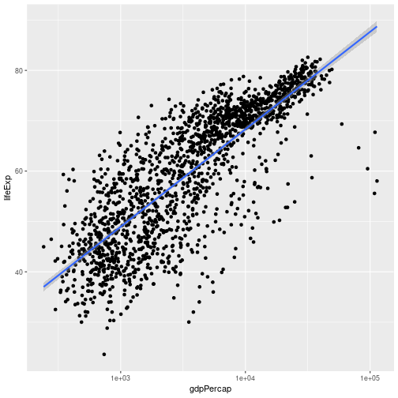

```r
suppressPackageStartupMessages(library(tidyverse))
library(gapminder)
library(broom)
```

So you want to fit a model to your data. How can you achieve this with R?

Topics:

1. What _is_ model-fitting?
2. How do we fit a model in R?
3. How can we obtain tidy results from the model output?

## What is Model-Fitting?

When variables are not independent, then we can gain information about one variable if we know something about the other.

Examples: Use the scatterplot below:

1. A car weighs 4000 lbs. What can we say about its mpg?
2. A car weights less than 3000 lbs. What can we say about its mpg?


```r
library(tidyverse)
ggplot(mtcars, aes(wt, mpg)) +
  geom_point() +
  labs(x = "Weight (1000's of lbs)")
```


Example: What can we say about rear axle ratio if we know something about quarter mile time?


```r
ggplot(mtcars, aes(qsec, drat)) + 
  geom_point() +
  labs(x = "Quarter mile time",
       y = "Rear axle ratio")
```


If EDA isn't enough, we can answer these questions by fitting a model: a curve that predicts Y given X. Aka, a __regression curve__ or a __machine learning model__. 

(There are more comprehensive models too, such as modelling entire distributions, but that's not what we're doing here)

There are typically two goals of fitting a model:

1. Make predictions.
2. Interpret variable relationships.

## Fitting a model in R

Model fitting methods tend to use a common format in R:

```
method(formula, data, options)
```

They also tend to have a common output: a special _list_. 

__Method__:

A function such as:

- Linear Regression: `lm`
- Generalized Linear Regression: `glm`
- Local regression: `loess`
- Quantile regression: `quantreg::rq`
- ...

__Formula__:

In R, takes the form `y ~ x1 + x2 + ... + xp` (use column names in your data frame).

__Data__: The data frame.

__Options__: Specific to the method.

Exercise:

1. Fit a linear regression model to life expectancy ("Y") from log(GDP per capita) ("X") by filling in the formula. Notice what appears as the output.
2. On a new line, use the `unclass` function to uncover the object's true nature: a list. Note: it might be easier to use the `names` function to see what components are included in the list. 


```r
(my_lm <- lm(FILL_THIS_IN, data=gapminder))
```

```
## Error in stats::model.frame(formula = FILL_THIS_IN, data = gapminder, : object 'FILL_THIS_IN' not found
```

To complicate things further, some info is stored in _another_ list after applying the `summary` function:


```r
summary(my_lm) %>% 
  names()
```

```
## Error in summary(my_lm): object 'my_lm' not found
```

We can use the `predict()` function to make predictions from the model (default is to use fitting/training data). Here are the predictions:


```r
predict(my_lm) %>% 
  head()
```

```
## Error in predict(my_lm): object 'my_lm' not found
```

We can plot models (with one predictor/ X variable) using `ggplot2` through the `geom_smooth()` layer. Specifying `method="lm"` gives us the linear regression fit (but only visually!):


```r
ggplot(gapminder, aes(gdpPercap, lifeExp)) +
    geom_point() +
    geom_smooth(method="lm") +
    scale_x_log10()
```




## Broom

Let's make it easier to extract info, using the `broom` package. There are three crown functions in this package, all of which input a fitted model, and outputs a tidy data frame.

1. `tidy`: extract statistical summaries about each component of the model.
    - Useful for _interpretation_ task.
2. `augment`: add columns to the original data frame, giving information corresponding to each row.
    - Useful for _prediction_ task.
3. `glance`: extract statistical summaries about the model as a whole (1-row tibble).
    - Useful for checking goodness of fit.

Exercise: apply all three functions to our fitted model, `my_lm`. What do you see?


